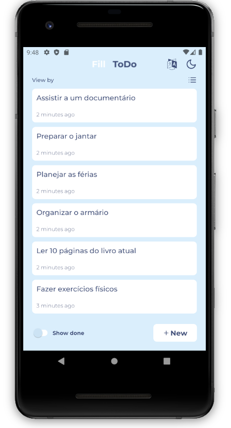

## Fill Todo 🚀

This project was developed using expo.
To execute the project you need to run the command:

`yarn android`
or
`yarn ios`

Main libraries used in the project:

- zustand
- styled-components
- react-hook-form
- zod
- i18next
- react-i18next
- expo-font
- react-native-mmkv
- @react-navigation/native
- @react-navigation/stack
- date-fns

user interface

